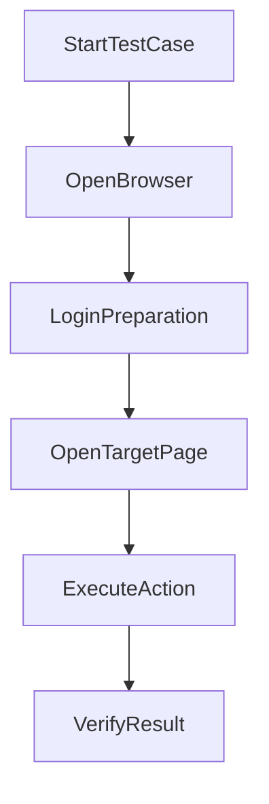
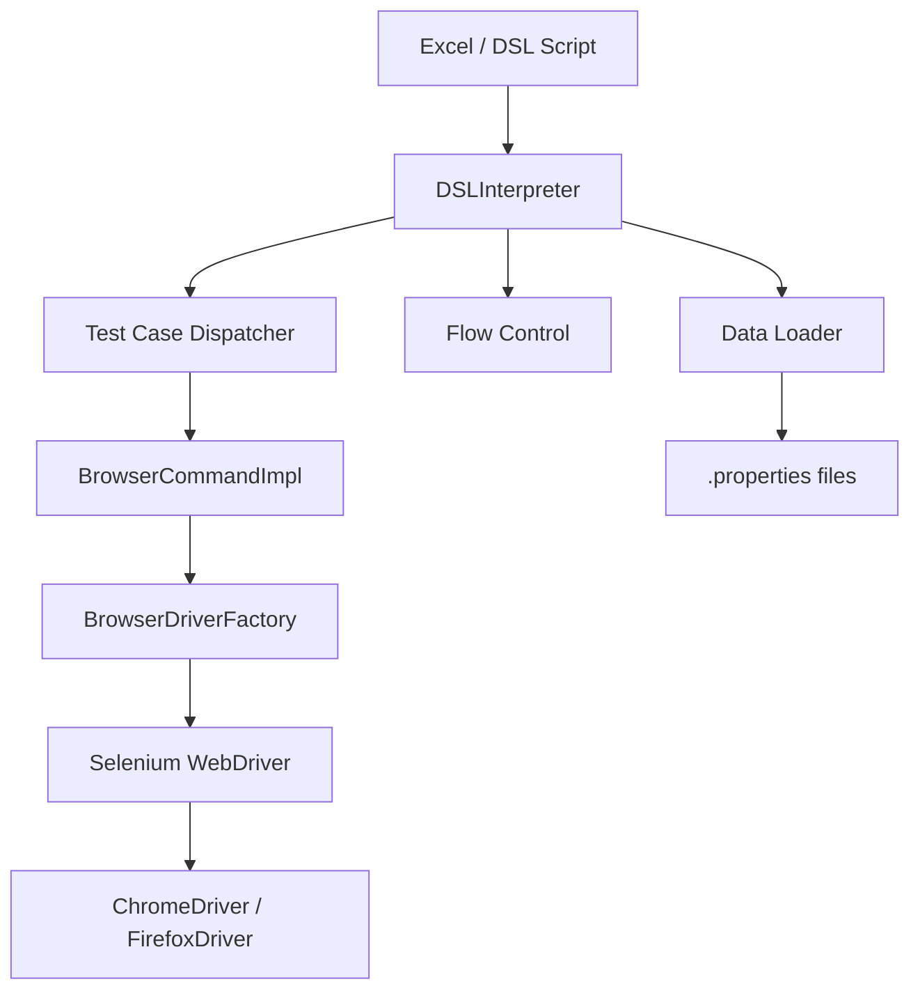
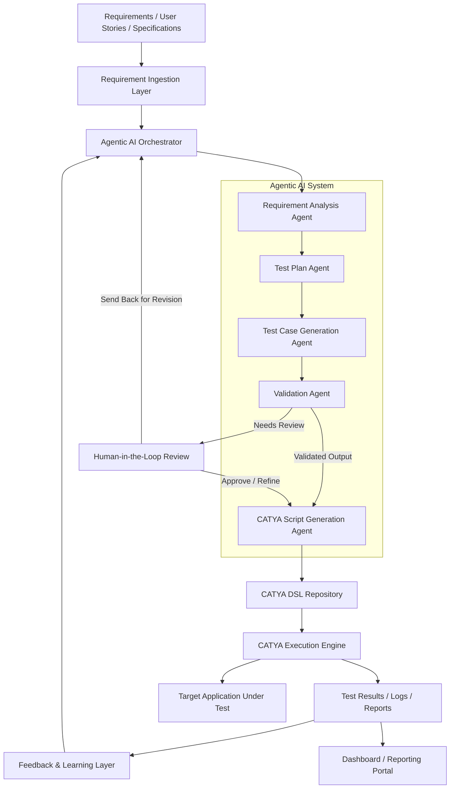

# CATYA – Browser Automation DSL Framework

CATYA is a **Java + Selenium-based automation framework** that executes browser actions using a custom **DSL (Domain-Specific Language)**.

---

## Features
- DSL-driven automation
- Excel-based test scripts
- Selenium WebDriver integration
- Screenshot on failure
- Conditional logic (IF / LOOP)
- Data-driven testing via properties files
- Reusable test cases (function-like behavior)

---

## Requirements
- Java 8+
- Maven 3+
- Chrome / Firefox
- WebDriver (ChromeDriver, GeckoDriver)

---

## Setup

```bash
git clone https://github.com/avilanorwin/catya.git
cd catya
mvn clean compile
mvn exec:java
```

---

## Test Case Design (Important)

### Entry Point: Start

A CATYA script should have a **Start** test case that serves as the entry point of execution.

You can think of it like the `main()` function of a program.

Example:
Run the catya application and input the following in the UI. Note that Item is auto filled-up once Test Case is filled-up.

| Item | Test Cases| Steps                                                                  | Expected Result | Actual Result | Status |
|------|-----------|------------------------------------------------------------------------|-----------------|---------------|--------|
| 1    | start     | OPEN browser="chrome"                                                  |                 |               |        |
|      |           | NAVIGATE url="https://www.calculator.net/percent-calculator.html"      |                 |               |        |
|      |           | INPUT id="cpar1" value="10"                                            |                 |               |        |
|      |           | INPUT id="cpar2" value="50"                                            |                 |               |        |
|      |           | CLICK xpath="//input[@value='Calculate']"                              |                 |               |        |
|      |           | WAIT_VISIBLE xpath="//p[@class='verybigtext']" timeout=10              |                 |               |        |
|      |           | VERIFY xpath="//*[@id='content']/p[2]/font/b"                          |                 |               |        |

Test cases can be reused to reduce redundancy and improve maintainability. A test case functions like a reusable unit that can be invoked within the **start** test case.

---

### Calling Other Test Cases

From the **start** test case, you can **call other test cases**.

Example:

```txt
call NavigatePage
call InputValue
call SubmitCalculation
```

This allows large test scenarios to be split into smaller, readable units.

---

### Reusable Preparatory Test Cases

You can create **preparatory test cases** for common setup steps to avoid repeating the same sequence in multiple tests.

This is similar to creating a reusable **function**.

A common example is a successful login flow.

#### Example: reusable login preparation

| Item | Test Cases        | Steps                                      | Expected Result | Actual Result | Status |
|------|------------------|--------------------------------------------|-----------------|---------------|--------|
| 1    | LoginPreparation | OPEN browser="chrome"                      |                 |               |        |
|      |                  | NAVIGATE url=$login_url                    |                 |               |        |
|      |                  | INPUT id="username" value=$username        |                 |               |        |
|      |                  | INPUT id="password" value=$password        |                 |               |        |
|      |                  | CLICK id="loginBtn"                        |                 |               |        |
|      |                  | WAIT_VISIBLE id="dashboard" timeout=10     |                 |               |        |

Then another test case can reuse it:

| Item | Test Cases     | Steps                                                                 | Expected Result | Actual Result | Status |
|------|----------------|-----------------------------------------------------------------------|-----------------|---------------|--------|
| 2    | LoginPreparation | Execute necessary commands here to complete the test case            |                 |               |        |
| 3    | OpenTransferPage | Execute necessary commands here to complete the test case            |                 |               |        |
| 4    | SubmitTransfer   | Execute necessary commands here to complete the test case            |                 |               |        |
| 5    | VerifyTransferSuccess | Execute necessary commands here to complete the test case       |                 |               |        |
| 6    | Start  | call LoginPreparation                                                |                 |               |        |
|      |                | call OpenTransferPage                                                |                 |               |        |
|      |                | call SubmitTransfer                                                  |                 |               |        |
|      |                | call VerifyTransferSuccess                                           |                 |               |        |

This avoids copying the same login steps into every test case.

---

## Why This Design Is Useful

- avoids redundant steps
- improves readability
- makes maintenance easier
- supports modular test design
- lets you organize tests like small reusable functions

---

## Before vs After Reuse

### Without reusable test cases
A lot of redundant steps like open browser, navigate url, etc... This makes the test cases very difficult to maintain.
```txt
TransferTest
OPEN browser="chrome"
NAVIGATE url=$ login_url
INPUT id="username" value=$ username
INPUT id="password" value=$ password
CLICK id="loginBtn"
WAIT_VISIBLE id="dashboard" timeout=10
CLICK id="transferMenu"
INPUT id="amount" value="1000"
CLICK id="submitBtn"
VERIFY id="successMsg" value="Transfer Successful"

HistoryTest
OPEN browser="chrome"
NAVIGATE url=$ login_url
INPUT id="username" value=$ username
INPUT id="password" value=$ password
CLICK id="loginBtn"
WAIT_VISIBLE id="dashboard" timeout=10
CLICK id="historyMenu"
VERIFY id="historyTitle" value="Transaction History"
```

### With reusable test cases

```txt
LoginPreparation
OPEN browser="chrome"
NAVIGATE url=$ login_url
INPUT id="username" value=$ username
INPUT id="password" value=$ password
CLICK id="loginBtn"
WAIT_VISIBLE id="dashboard" timeout=10

TransferTest
call LoginPreparation
CLICK id="transferMenu"
INPUT id="amount" value="1000"
CLICK id="submitBtn"
VERIFY id="successMsg" value="Transfer Successful"

HistoryTest
call LoginPreparation
CLICK id="historyMenu"
VERIFY id="historyTitle" value="Transaction History"
```

The second version is cleaner and easier to maintain.

---

## Test Case Flow Diagram



---

## Demo: Percentage Calculator Test

> This example uses the public website `https://calculator.net` for demonstration purposes only.  
> The website is not owned by this project.

### Test Target

`https://calculator.net/percentage-calculator.html`

## Sample Execution

Sample variable file
data/calculator.properties
```txt
#Calculator
calculator_net_homeurl = http://www.calculator.net
percentage_calc_link = .//*[@id='hl3']/li[3]/a
calc_button = //input[@type='submit' and @value='Calculate']
result = .//*[@id='content']/p[2]/font/b
value1 = 100
value2 = 50
```


---

## DSL Syntax

```txt
COMMAND param="value"
```

---

## Commands

### Browser Control

```txt
OPEN browser="chrome"
CLOSE browser="chrome"
QUIT
```

### Navigation

```txt
NAVIGATE url="https://example.com" timeout=10
REFRESH
```

### Actions

```txt
CLICK id="loginBtn"
DOUBLECLICK id="item1"
INPUT id="username" value="admin"
CLEAR id="username"
```

### Verification

```txt
VERIFY id="message" value="Success"
IS_ELEMENT_VISIBLE id="dashboard" value="true"
IS_ELEMENT_ENABLED id="submitBtn" value="true"
IS_ELEMENT_SELECTED id="rememberMe" value="true"
```

### Waits

```txt
WAIT_VISIBLE id="dashboard" timeout=30
WAIT_CLICKABLE id="submitBtn" timeout=20
PAUSE time=3
```

### Dropdown

```txt
SELECT id="country" name="Japan"
SELECT id="country" index="1,2"
DESELECT id="country" index="all"
```

### Screenshot

```txt
PRINTSCREEN itemNo=1
```

### Data Loading

```txt
LOAD data="login"
```

`LOAD data="login"` loads values from a properties file, such as `data/login.properties`, so you can reuse strings like URLs, usernames, passwords, and expected messages.

Example:

```properties
login_url=https://example.com/login
username=admin
password=1234
welcomeMessage=Welcome Admin
```

Then use them in the script:

```txt
LOAD data="login"
NAVIGATE url=$ login_url
INPUT id="username" value=$ username
INPUT id="password" value=$ password
VERIFY id="welcomeMsg" value=$ welcomeMessage
```

This reduces duplication and makes scripts easier to maintain.

### Flow Control

```txt
IF $ result is Passed
FI

LOOP 3 times
POOL
EXIT loop
```

---

## Architecture



---

## Notes

- Supported locators: `id`, `xpath`, `name`
- `VERIFY` supports equality only
- Default timeout is about 10 seconds unless overridden
- Screenshots are saved under `/screenshots/`
- Keep binary files like `.png` protected in Git using a `.gitattributes` file

---

## Future Enhancements

### Agentic AI–Driven Test Automation

As agentic AI continues to evolve, I am exploring how this tool can be enhanced by incorporating multiple AI agents across the full testing lifecycle, including requirements analysis, test planning, test execution, test reporting, and automated recommendations for production readiness.

This initiative is part of my ongoing effort to deepen my understanding of agentic AI and to apply these concepts in future system designs as a Technology Architect.

The objective is to design a system that:

- analyzes input requirements such as user stories and specifications  
- generates structured and traceable test plans  
- produces reusable and modular test cases aligned with business workflows  
- incorporates human-in-the-loop validation to ensure correctness, completeness, and alignment with expected behavior  
- translates validated test cases into CATYA DSL scripts for deterministic execution  
- executes generated scripts through the CATYA engine  
- leverages execution results to improve test quality, coverage, and future test generation  

This approach separates **intelligent test generation** from **deterministic execution**, enabling scalability while preserving reliability.

---

### Architecture Overview



## Summary

CATYA supports:

- DSL scripting
- reusable test cases like functions
- modular test design
- data-driven testing through properties files
- real browser automation using Selenium

Design your CATYA test cases the same way you design clean software: small, reusable, and easy to understand.

