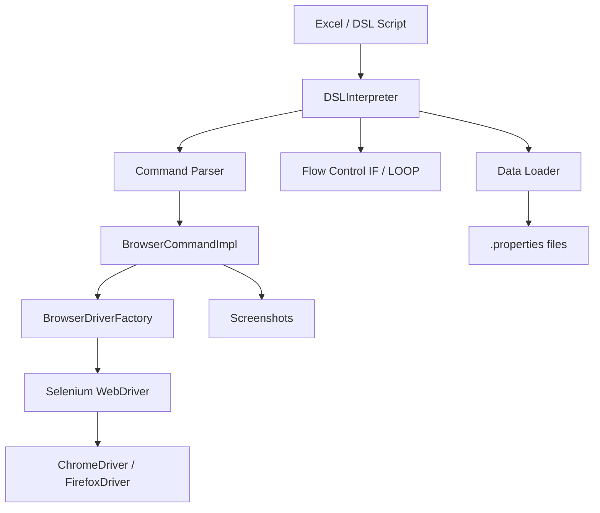

# CATYA – Browser Automation DSL Framework

CATYA is a **Java + Selenium-based automation framework** that executes browser actions using a custom **DSL (Domain-Specific Language)**.

---

## Features
- DSL-driven automation (no coding required)
- Excel-based test scripts
- Selenium WebDriver integration
- Screenshot on failure
- Conditional logic (IF / LOOP)
- Data-driven testing via properties files

---

## Requirements
- Java 8+
- Maven 3+
- Chrome / Firefox
- WebDriver (ChromeDriver, GeckoDriver)

---

## Setup

```bash
git clone https://github.com/avilanorwin/catya.git
cd catya
mvn clean compile
mvn exec:java
```

---

## Demo: Percentage Calculator Test

> This example uses a public website (https://calculator.net) for demonstration purposes only.  
> The site is not owned by this project.

### Test Target
https://calculator.net/percentage-calculator.html

---

### Test Script

```txt
OPEN browser="chrome"

NAVIGATE url="https://calculator.net/percentage-calculator.html"

INPUT id="cpar1" value="10"
INPUT id="cpar2" value="50"

CLICK xpath="//input[@value='Calculate']"

WAIT_VISIBLE xpath="//p[@class='verybigtext']" timeout=10

VERIFY xpath="//p[@class='verybigtext']" value="5"
```

---

### Expected Result

```
10% of 50 = 5
```

---

## Sample Execution


> Place your screenshot in: `docs/demo.png`

---

## DSL Syntax

```
COMMAND param="value"
```

---

## Commands

### Browser Control
```
OPEN browser="chrome"
CLOSE browser="chrome"
QUIT
```

### Navigation
```
NAVIGATE url="https://example.com" timeout=10
REFRESH
```

### Actions
```
CLICK id="loginBtn"
DOUBLECLICK id="item1"
INPUT id="username" value="admin"
CLEAR id="username"
```

### Verification
```
VERIFY id="message" value="Success"
IS_ELEMENT_VISIBLE id="dashboard" value="true"
IS_ELEMENT_ENABLED id="submitBtn" value="true"
IS_ELEMENT_SELECTED id="rememberMe" value="true"
```

### Waits
```
WAIT_VISIBLE id="dashboard" timeout=30
WAIT_CLICKABLE id="submitBtn" timeout=20
PAUSE time=3
```

### Dropdown
```
SELECT id="country" name="Japan"
SELECT id="country" index="1,2"
DESELECT id="country" index="all"
```

### Screenshot
```
PRINTSCREEN itemNo=1
```

### Data
```
LOAD data="login"
```

### Flow Control
```
IF $ result is Passed
FI

LOOP 3 times
POOL
EXIT loop
```

---

## Architecture



---

## Notes
- Supported locators: id, xpath, name
- VERIFY supports equality only
- Default timeout ~10 seconds
- Screenshots saved under `/screenshots/`

---

## Summary

CATYA is a lightweight **test automation platform**:
- DSL (test definition)
- Java engine (execution)
- Selenium (browser control)
